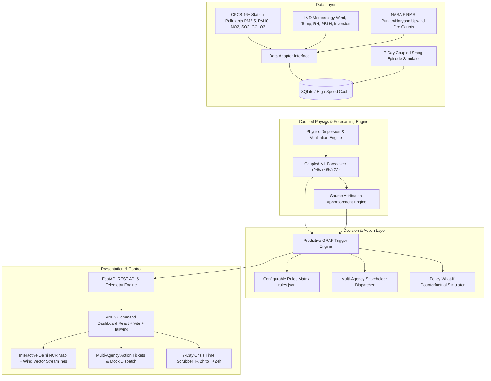

# PROJECT PLAN — SIH26082
## Air Pollution–Weather Coupled Forecasting System (Delhi NCR Focus)
**Ministry of Earth Sciences (MoES) | Theme: Disaster Management | Track: Software**

---

### 1. Problem Statement & Core Value Proposition
Current management of severe air pollution in Delhi NCR relies on the **Graded Response Action Plan (GRAP)**, which is fundamentally **reactive** — emergency curbs (Stage 3/4 construction halts, truck entry restrictions, school closures) are triggered only *after* AQI monitors record dangerous spikes.

**Our Core Innovation:** **Predictive GRAP (Forecast-Triggered Graded Response)**
By coupling dynamic meteorology (Boundary Layer Height compression, Thermal Inversion, Wind Vector) with upwind satellite fire counts (NASA FIRMS Punjab/Haryana stubble burning) and station pollutant sensors, our system forecasts AQI 24h, 48h, and 72h in advance. It automatically calculates source attribution and dispatches proactive, role-specific action triggers with **2 to 3 days of lead time** to state and municipal authorities before the smog settles.

---

### 2. System Architecture

---

### 3. Module Breakdown & Technology Stack

| Layer | Module | Description & Tech |
|---|---|---|
| **Backend API** | `FastAPI`, `Uvicorn`, `Pydantic` | Asynchronous REST endpoints, high performance, structured JSON validation |
| **Data Layer** | `app/data/` | Dual-mode adapter (Live API stubs + 7-Day high-fidelity Coupled Synthetic Episode) |
| **Physics/ML** | `app/models/` | Ventilation Index ($WS \times PBLH$), Inversion Trapping Factor ($K_{trap}$), Upwind Stubble Plume Vector ($NW \rightarrow SE$), Gradient Boosting / Ridge regression with 90% confidence bands |
| **Attribution** | `app/models/attribution.py` | Real-time source apportionment: Stubble Burning, Vehicular, Industrial, Dust, Secondary PM |
| **Trigger Engine**| `app/engine/grap_trigger.py` | Configurable `rules.json` matching severity, lead time, responsible agency, and pre-emptive curbs |
| **Stakeholder Dispatch**| `app/engine/alerts.py` | Role-specific dispatch payloads for CAQM, Police, Agri Dept, MCD, Schools, Hospitals, Citizens |
| **Frontend UI** | `React`, `Vite`, `TailwindCSS`, `Lucide Icons` | Obsidian dark-mode command center, interactive geospatial map, particle wind field, time-travel scrubber |

---

### 4. Evaluation Checklist for SIH Judges

- [x] **Predictive vs Reactive GRAP Demonstration**: Shows exact lead time gained (24-72 hours) compared to standard reactive protocols.
- [x] **Explicit Physics Coupling**: Exposes Ventilation Index ($m^2/s$), boundary layer compression, and thermal inversion coefficient rather than a black box.
- [x] **Source-Specific Interventions**: Differentiates between stubble burning (agri alerts), vehicular (stagnant day odd-even), and dust (pre-emptive anti-smog guns).
- [x] **Cross-State Inter-Agency Coordination**: Multi-state dashboard (Delhi, Punjab, Haryana, UP, Rajasthan).
- [x] **100% Offline Demo Reliability**: Zero failure risk during hackathon evaluation via built-in synthetic crisis scenario.
- [x] **"What-If" Counterfactual Policy Simulator**: Enables judges to test policy impacts (e.g. 50% stubble reduction) and see predicted AQI drops in real time.
