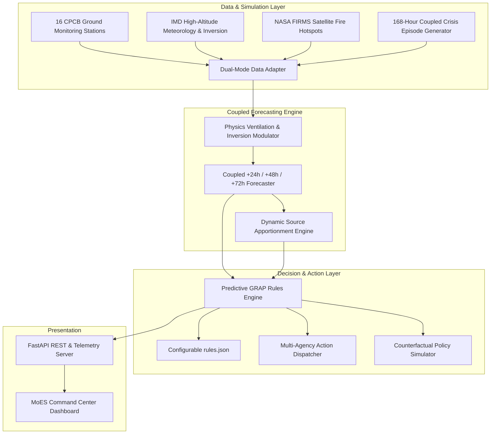

# SIH26082 — Ministry of Earth Sciences (MoES)
## Air Pollution–Weather Coupled Forecasting System (Delhi NCR Focus)
**Theme:** Disaster Management | **Track:** Software | **Smart India Hackathon 2026**

---

## 🌟 Executive Summary & The Core Innovation

Delhi's current air quality management relies on the **Graded Response Action Plan (GRAP)**, which operates **reactively** — emergency restrictions (halting construction, diverting trucks, closing primary schools) are only triggered *after* ground monitoring stations confirm dangerous AQI levels (e.g. crossing 400+ for 48 hours).

### 🚀 Our Breakthrough: **Predictive GRAP (Forecast-Triggered Graded Response)**
Air pollution in the landlocked Delhi NCR basin is fundamentally **coupled with dynamic meteorology**. By mathematically coupling:
1. **Planetary Boundary Layer Height (PBLH) compression**,
2. **Thermal Inversion ($\Delta T$) trapping**,
3. **Wind stagnation and North-Westerly direction shifts ($315^\circ$)**, and
4. **NASA FIRMS satellite-detected farm fire counts in Punjab & Haryana**,

our system predicts severe AQI spikes **24 to 72 hours in advance** with 90% confidence bands. It automatically dispatches pre-emptive, role-specific action triggers to state and municipal authorities, securing **2 to 3 days of lead time** to prevent the crisis before the smog settles.

---

## 🔬 How the Meteorology–Pollution Coupling Works

Instead of an opaque black-box model, the system explicitly computes and visualizes atmospheric physics:

### 1. Ventilation Index ($VI$)
$$VI = WS_{\text{m/s}} \times \text{PBLH}_{\text{m}} \quad (\text{m}^2/\text{s})$$
- **Favorable (> 3,500 $\text{m}^2/\text{s}$):** Rapid atmospheric dispersion.
- **Critical Trapping (< 2,000 $\text{m}^2/\text{s}$):** Delhi basin becomes an atmospheric lid, concentrating ground emissions.

### 2. Inversion Trapping Factor ($K_{\text{trap}}$)
$$K_{\text{trap}} = 1.0 + 0.38 \times \Delta T_{\text{inversion}} + 1.4 \times \max\left(0, \frac{2500 - VI}{2500}\right)$$
- Accounts for nighttime thermal inversion capping emissions near the ground.

### 3. Upwind Stubble Transport Vector ($S_{\text{vector}}$)
$$S_{\text{vector}} = \text{FireCount} \times \max\left(0, \cos(\theta_{\text{wind}} - 315^\circ)\right)$$
- Projects the dot product of wind direction with the North-West stubble plume corridor.

---

## 🏛️ System Architecture



---

## 🎯 Key Capabilities for the 3–5 Minute Judge Demo

| Feature | Description | Real-World Impact |
|---|---|---|
| **Predictive vs Reactive GRAP** | Live comparison showing 48–72h lead time gained for every rule. | Construction sites stabilize materials in advance; interstate trucks reroute before entering Delhi. |
| **7-Day Crisis Time Scrubber** | Interactive playback of a 168-hour coupled pollution spike event. | Judges can scrub from T-72h (Moderate) to T-48h (Warning) and watch emergency alerts fire. |
| **Dynamic Spatial Grid & Wind Field** | Real-time SVG map with 16 Delhi NCR stations, animated wind streamlines, and satellite fire clusters. | Visualizes trans-boundary smoke transport from Punjab/Haryana straight into the Delhi basin. |
| **Multi-Stakeholder Action Dispatch** | Tailored action checklists and mock dispatch payloads for Agri Dept, Traffic Police, MCD, Education, Hospitals, and Citizens. | Demonstrates full disaster-management loop, not just raw AQI numbers. |
| **Cross-State Coordination Grid** | Inter-state early warning matrix for Delhi, Punjab, Haryana, UP, and Rajasthan. | Acknowledges that 30–40% of Delhi smog is trans-boundary and requires inter-state synchronization. |
| **"What-If" Counterfactual Simulator** | Sliders to adjust stubble burning, truck bans, and misting to see immediate simulated AQI drops. | Proves how pre-emptive policy interventions avert peak emergency levels. |

---

## 🚀 Quickstart & Local Setup

The system is designed to run **100% offline** on any laptop with zero external API dependencies during judging.

### Prerequisites
- Python 3.10+ (Dependencies auto-installed)

### 1. One-Click Startup
```bash
cd /Users/vivekraj/.gemini/antigravity-ide/scratch/sih-coupled-aqi-delhi
./run.sh
```
*Or manually:*
```bash
python3 run.py
```

### 2. Access the Application
- **Interactive Command Center Dashboard:** [http://127.0.0.1:8000](http://127.0.0.1:8000)
- **Interactive OpenAPI Documentation:** [http://127.0.0.1:8000/docs](http://127.0.0.1:8000/docs)

---

## 📋 Evaluation Checklist & Demo Script for Judges

1. **Open the Dashboard at `http://127.0.0.1:8000`**.
2. **Explain the Pitch (30s):** "Current GRAP is reactive — our system couples meteorology with satellite stubble data to make GRAP predictive with 48h lead time."
3. **Scrub to T-72h (Day 3):** Show how monitored AQI is still Moderate (~220), but the model detects boundary layer collapse and drops in wind speed, forecasting Severe (480+) for T+48h.
4. **Switch to Predictive GRAP Matrix:** Show how Stage 3/4 curbs are already in **PRE-EMPTIVE TRIGGER** state, buying 48 hours of lead time.
5. **Switch to Stakeholder Dispatches:** Show the specific, actionable orders dispatched to Punjab Agriculture (Happy Seeders) and Delhi Police (EPE/WPE truck diversions).
6. **Switch to What-If Simulator:** Move the Stubble Reduction slider to 50% and Truck Bypass to 40% to show that peak AQI drops from 480 (Emergency) down to 386 (Managed).

---

## 🔭 Production Roadmap & Real-World Integration

- **Operational Weather Model:** Direct coupling with IMD's 3km Eulerian WRF-Chem (Weather Research and Forecasting with Chemistry) model.
- **Satellite Telemetry:** Automated ingestion of INSAT-3D Aerosol Optical Depth (AOD) and Sentinel-5P TROPOMI trace gases ($NO_2$, $SO_2$).
- **CEMS Integration:** Real-time continuous emission monitoring telemetry from Delhi NCR industrial stacks and power plants.
